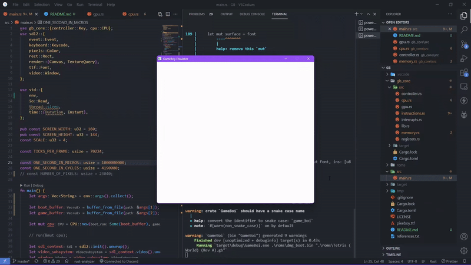

# Rusty-boii

A simple Nintendo GameBoy emulator written in Rust and SDL2.



## Compiling instructions

The emulator can to compiled with rust's package manager cargo by:

```bash
cargo build --release
```

## Running instructions

The emulator expects two arguments to run

- Game-rom - Actual game
- Boot-rom - If you want the Nintendo splash screen

```bash
$ GameBoi <GameRom-Path> <BootRom-Path(Optional)>
```

## TODOs

- [ ] Add support for X8800 tiles
- [ ] Add better timer support
- [ ] Add sound subsystem
